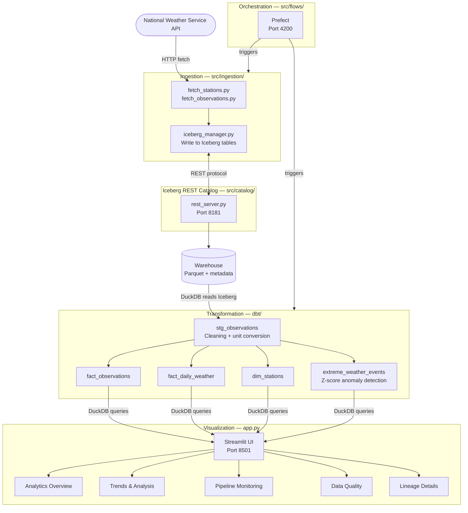
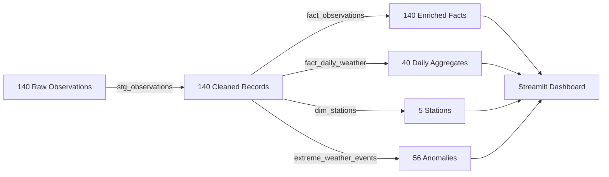

# Weather Data Platform

[](https://www.python.org/downloads/)
[](https://python-poetry.org/)
[](https://duckdb.org/)
[](https://www.getdbt.com/)
[](https://streamlit.io/)
[](https://iceberg.apache.org/)

Production-ready data engineering project demonstrating **DuckDB**, **dbt**, **Apache Iceberg**, **Prefect orchestration**, and **Streamlit visualization** with a unified web UI.

## Quick Start

```bash
poetry install
poetry run streamlit run app.py
```

Opens: **http://localhost:8501**

## Architecture


```mermaid
flowchart TD
    A([National Weather Service API]) -->|HTTP fetch| B[fetch_stations.py\nfetch_observations.py]

    subgraph Ingestion ["Ingestion — src/ingestion/"]
        B --> C[iceberg_manager.py\nWrite to Iceberg tables]
    end

    subgraph Catalog ["Iceberg REST Catalog — src/catalog/"]
        D[rest_server.py\nPort 8181]
    end

    C <-->|REST protocol| D
    D --> E[(Warehouse\nParquet + metadata)]

    subgraph Transformation ["Transformation — dbt/"]
        F[stg_observations\nCleaning + unit conversion]
        F --> G[fact_observations]
        F --> H[fact_daily_weather]
        F --> I[dim_stations]
        F --> J[extreme_weather_events\nZ-score anomaly detection]
    end

    E -->|DuckDB reads Iceberg| F

    subgraph Orchestration ["Orchestration — src/flows/"]
        K[Prefect\nPort 4200]
    end

    K -->|triggers| Ingestion
    K -->|triggers| Transformation

    subgraph Visualization ["Visualization — app.py"]
        L[Streamlit UI\nPort 8501]
        L --> L1[Analytics Overview]
        L --> L2[Trends & Analysis]
        L --> L3[Pipeline Monitoring]
        L --> L4[Data Quality]
        L --> L5[Lineage Details]
    end

    G & H & I & J -->|DuckDB queries| L
```

## Data Flow


```mermaid
flowchart LR
    A[140 Raw Observations] -->|stg_observations| B[140 Cleaned Records]
    B -->|fact_observations| C[140 Enriched Facts]
    B -->|fact_daily_weather| D[40 Daily Aggregates]
    B -->|dim_stations| E[5 Stations]
    B -->|extreme_weather_events| F[56 Anomalies]
    C & D & E & F --> G[Streamlit Dashboard]
```

## Features

- **Real-time Analytics Dashboard** - Interactive visualizations with Plotly
- **Pipeline Monitoring** - Architecture, record flow, status tracking
- **Data Quality Metrics** - NULL checks, statistics, uniqueness validation
- **Complete Lineage** - dbt model dependencies and documentation
- **Apache Iceberg** - Production-grade table format with custom REST catalog
- **DuckDB** - Native Iceberg support with v1.4.2+
- **dbt** - 5 production models (staging + 4 marts)
- **Prefect** - Workflow orchestration at http://localhost:4200
- **Multi-Cloud** - S3, Azure Blob Storage, GCS support

## Project Structure

```
duckdb-dbt/
├── app.py                     Unified Streamlit UI (5 pages)
├── dbt/
│   ├── models/
│   │   ├── staging/
│   │   │   └── stg_observations.sql
│   │   └── marts/
│   │       ├── fact_observations.sql
│   │       ├── fact_daily_weather.sql
│   │       ├── dim_stations.sql
│   │       └── extreme_weather_events.sql
│   ├── dbt_project.yml
│   └── profiles.yml
├── src/
│   ├── catalog/
│   │   └── rest_server.py     Iceberg REST catalog (port 8181)
│   ├── flows/                 Prefect workflows
│   └── ingestion/             Data fetching and loading
├── config/
│   └── storage.yaml           Multi-cloud storage config
├── scripts/                   Helper scripts
├── examples/                  Demo scripts
├── docs/
│   └── CLAUDE.md              Technical deep-dive
└── pyproject.toml
```

## Installation

```bash
poetry install
poetry run streamlit run app.py
```

## Optional Services

### Prefect Orchestration

```bash
poetry run prefect server start  # http://localhost:4200
```

### dbt Documentation

```bash
cd dbt && dbt docs serve         # http://localhost:8000
```

### Query Data Directly

```bash
poetry run duckdb weather.duckdb
> SELECT * FROM main_marts.fact_observations LIMIT 5;
```

## Configuration

Edit `config/storage.yaml` to switch storage backends:

```yaml
storage:
  backend: local              # or: s3, azure, gcs

table_format: iceberg

iceberg:
  catalog:
    type: rest
    uri: http://localhost:8181
```

## Technology Stack

| Layer | Technology | Version |
|-------|-----------|---------|
| Data Storage | DuckDB + Apache Iceberg | 1.4.2+ |
| Transformation | dbt | 1.10+ |
| Visualization | Streamlit + Plotly | 1.53+ / 6.5+ |
| Orchestration | Prefect | 3.6+ |
| Language | Python | 3.10+ |
| Dependency Mgmt | Poetry | Latest |

## Learn More

See **[docs/CLAUDE.md](docs/CLAUDE.md)** for Iceberg architecture deep-dive, REST catalog internals, Prefect setup, CI/CD, and production deployment.

## License

MIT License

---

`poetry run streamlit run app.py` → http://localhost:8501
