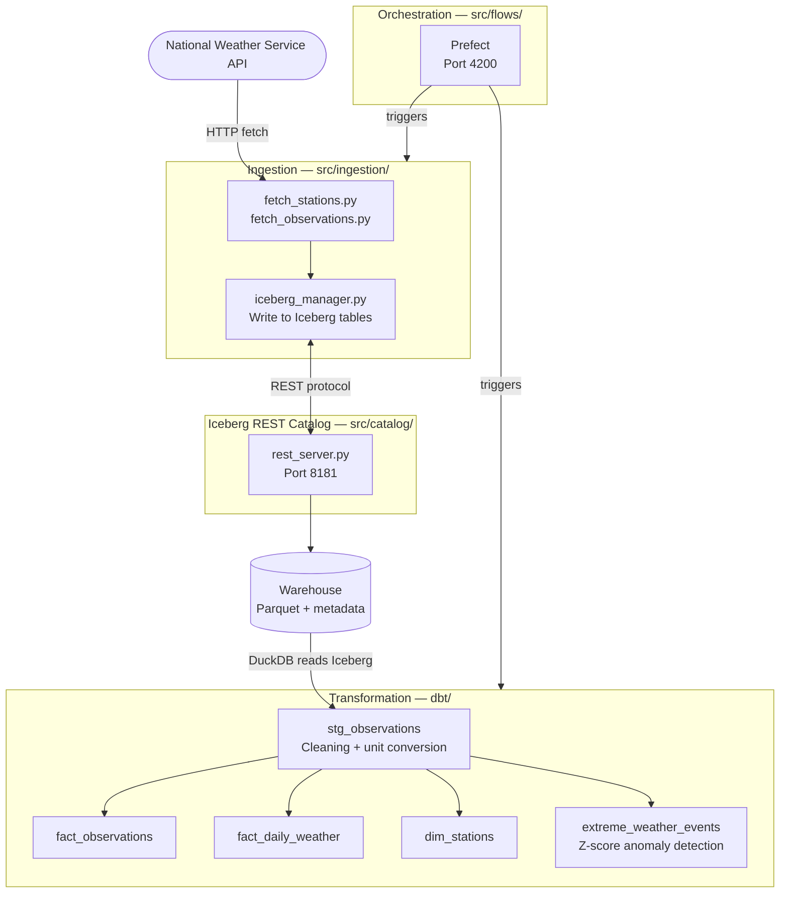
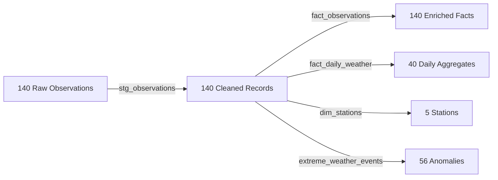

# Weather Data Platform

[](https://www.python.org/downloads/)
[](https://python-poetry.org/)
[](https://duckdb.org/)
[](https://www.getdbt.com/)
[](https://iceberg.apache.org/)

Production-ready data engineering project demonstrating **DuckDB**, **dbt**, **Apache Iceberg**, and **Prefect orchestration** with a custom REST catalog — powered by the National Weather Service API.

## Quick Start

```bash
poetry install

# Start the Iceberg REST catalog
poetry run catalog-server

# Fetch stations + observations
poetry run fetch-stations
poetry run fetch-observations

# Run dbt transformations
cd dbt && dbt run

# Run the full pipeline via Prefect
python scripts/run_and_watch.py pipeline
```

## Architecture


```mermaid
flowchart TD
    A([National Weather Service API]) -->|HTTP fetch| B[fetch_stations.py\nfetch_observations.py]

    subgraph Ingestion ["Ingestion — src/ingestion/"]
        B --> C[iceberg_manager.py\nWrite to Iceberg tables]
    end

    subgraph Catalog ["Iceberg REST Catalog — src/catalog/"]
        D[rest_server.py\nPort 8181]
    end

    C <-->|REST protocol| D
    D --> E[(Warehouse\nParquet + metadata)]

    subgraph Transformation ["Transformation — dbt/"]
        F[stg_observations\nCleaning + unit conversion]
        F --> G[fact_observations]
        F --> H[fact_daily_weather]
        F --> I[dim_stations]
        F --> J[extreme_weather_events\nZ-score anomaly detection]
    end

    E -->|DuckDB reads Iceberg| F

    subgraph Orchestration ["Orchestration — src/flows/"]
        K[Prefect\nPort 4200]
    end

    K -->|triggers| Ingestion
    K -->|triggers| Transformation
```

## Data Flow


```mermaid
flowchart LR
    A[140 Raw Observations] -->|stg_observations| B[140 Cleaned Records]
    B -->|fact_observations| C[140 Enriched Facts]
    B -->|fact_daily_weather| D[40 Daily Aggregates]
    B -->|dim_stations| E[5 Stations]
    B -->|extreme_weather_events| F[56 Anomalies]
```

## Features

- **Apache Iceberg** — Production-grade table format with ACID transactions, time travel, and schema evolution
- **Custom REST Catalog** — Implements the Iceberg REST spec (Flask + SQLite), no external catalog service needed
- **DuckDB** — Native Iceberg support via `iceberg_scan()`, v1.4.2+
- **dbt** — 5 production models: `stg_observations` → `fact_observations`, `fact_daily_weather`, `dim_stations`, `extreme_weather_events`
- **Prefect** — Workflow orchestration with retries, caching, and task dependencies at http://localhost:4200
- **Multi-Cloud** — S3, Azure Blob Storage, GCS support via `config/storage.yaml`

## Project Structure

```
duckdb-dbt/
├── dbt/
│   ├── models/
│   │   ├── staging/
│   │   │   └── stg_observations.sql
│   │   └── marts/
│   │       ├── fact_observations.sql
│   │       ├── fact_daily_weather.sql
│   │       ├── dim_stations.sql
│   │       └── extreme_weather_events.sql
│   ├── dbt_project.yml
│   └── profiles.yml
├── src/
│   ├── catalog/
│   │   └── rest_server.py     Iceberg REST catalog (port 8181)
│   ├── flows/                 Prefect workflows
│   └── ingestion/             Data fetching and Iceberg writes
├── config/
│   └── storage.yaml           Multi-cloud storage config
├── benchmarks/
│   ├── generate_data.py       Synthetic data generator (1M+ rows)
│   └── run_benchmark.py       Iceberg vs Parquet benchmark runner
├── scripts/                   Helper scripts
├── examples/                  Demo scripts
├── docs/
│   └── CLAUDE.md              Technical deep-dive
└── pyproject.toml
```

## Optional Services

### Prefect Orchestration

```bash
poetry run prefect server start  # http://localhost:4200
python scripts/run_and_watch.py  # pick a flow to run
```

### dbt Documentation

```bash
cd dbt && dbt docs serve         # http://localhost:8000
```

### Query Data Directly

```bash
poetry run duckdb weather.duckdb
> SELECT * FROM main_marts.fact_observations LIMIT 5;
```

## Configuration

Edit `config/storage.yaml` to switch storage backends:

```yaml
storage:
  backend: local              # or: s3, azure, gcs

table_format: iceberg

iceberg:
  catalog:
    type: rest
    uri: http://localhost:8181
```

## Technology Stack

| Layer | Technology | Version |
|-------|-----------|---------|
| Data Storage | DuckDB + Apache Iceberg | 1.4.2+ |
| Transformation | dbt | 1.10+ |
| Orchestration | Prefect | 3.6+ |
| Language | Python | 3.10+ |
| Dependency Mgmt | Poetry | Latest |

## Benchmarking: Iceberg vs Parquet

Measures the overhead of Iceberg's metadata layer vs raw Parquet, using the same DuckDB engine for both.

```bash
# Generate 1M synthetic observations (both formats)
poetry run python -m benchmarks.generate_data --rows 1000000

# Run benchmarks (5 iterations + 1 warmup per query)
poetry run python -m benchmarks.run_benchmark

# Save results to JSON
poetry run python -m benchmarks.run_benchmark --output benchmarks/results/latest.json
```

**Queries benchmarked** (mirror the dbt models):
| Query | What it tests |
|-------|--------------|
| `full_scan` | Sequential read of all columns |
| `count_star` | Metadata-only operation |
| `filtered_scan` | Predicate pushdown (station + date range) |
| `daily_aggregation` | GROUP BY with multiple aggregates |
| `anomaly_detection` | CTE + JOIN + Z-score calculation |
| `station_dimension` | Distinct + count aggregation |
| `window_function` | Rolling average with PARTITION BY |
| `multi_join_aggregation` | Percentiles + conditional aggregates |

**What to expect:**
- At 1M rows, Iceberg adds slight overhead (~5–15%) for scan-heavy queries due to metadata parsing
- For filtered queries, Iceberg can match or beat Parquet when partition/file pruning kicks in
- The fixed cost is the catalog metadata read; the variable cost scales with number of data files

## Learn More

See **[docs/CLAUDE.md](docs/CLAUDE.md)** for Iceberg architecture deep-dive, REST catalog internals, Prefect setup, CI/CD, and production deployment.

## License

MIT License
