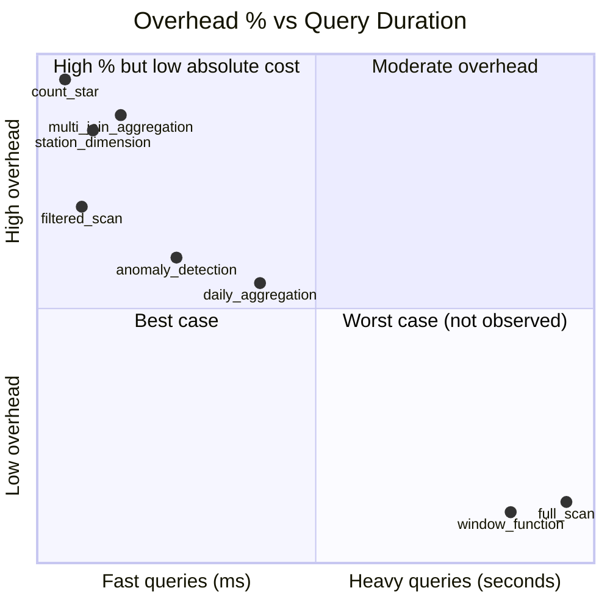
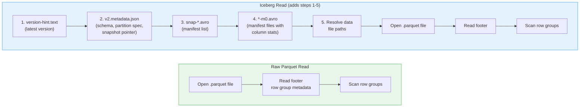
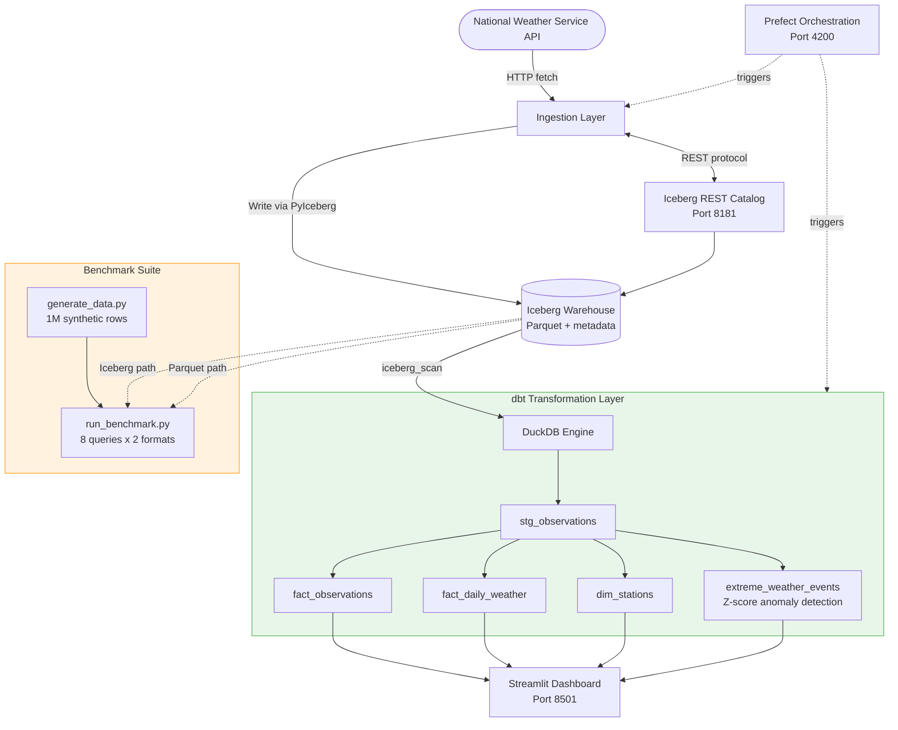

# Iceberg vs Parquet: Real-World Benchmarks with DuckDB at 1M Rows

*How much does Apache Iceberg's metadata layer actually cost you? We ran 8 analytical queries against both formats using DuckDB to find out.*

---

## TL;DR

We benchmarked Apache Iceberg against raw Parquet on 1 million synthetic weather observations using DuckDB as the query engine. The results were nuanced: **full table scans showed only 3.5% overhead**, and **window functions were essentially identical (-0.4%)**. But lightweight queries that finish in single-digit milliseconds on Parquet paid a steep relative penalty (97-1429%) because Iceberg's fixed metadata parsing cost dominates when the actual query work is trivial. The takeaway: Iceberg's overhead is a **fixed cost**, not a scaling problem.

---

## Why We Built This Benchmark

Our [Weather Data Platform](https://github.com/chanukya-pekala/duckdb-dbt) is a production-ready data engineering stack combining DuckDB, dbt, Apache Iceberg, Prefect orchestration, and Streamlit visualization. We use Iceberg as the table format for its time-travel, schema evolution, and partition pruning capabilities.

But every abstraction has a cost. When you wrap Parquet files in Iceberg's metadata layer, you add:

- **Catalog lookup** (SQLite in our case, REST in production)
- **Metadata JSON parsing** (table schema, partition specs, snapshot manifests)
- **Manifest file reads** (Avro files listing data file locations and stats)

We wanted to quantify that cost with queries that mirror our actual dbt models, not synthetic microbenchmarks.

## The Setup

### Data Generation

We generated **1,000,000 synthetic weather observations** covering:

- **10 major US airport stations** (KJFK, KLAX, KORD, KDEN, KMIA, KSEA, KATL, KDFW, KPHX, KBOS)
- **22 columns** including temperature, humidity, wind, pressure, precipitation
- **~2 years of hourly data** with realistic seasonal and diurnal patterns
- Correlated measurements (temperature inversely correlates with humidity, etc.)

The same data was written in two formats:
1. **Raw Parquet** - single file, Snappy compression
2. **Apache Iceberg** - full table with PyIceberg, SQLite catalog, proper metadata versioning

### Query Engine

**DuckDB 1.4.2** was the sole query engine for both formats. This isolates the storage format overhead, since the execution engine is identical. DuckDB reads Iceberg tables via its native `iceberg_scan()` extension.

### Methodology

- **5 timed iterations** per query, per format
- **1 warmup iteration** (excluded from results)
- **Metrics**: Median, Mean, Min, Max, P95, Standard Deviation
- **Comparison**: Overhead % = (Iceberg median - Parquet median) / Parquet median x 100

---

## The 8 Benchmark Queries

Each query mirrors a transformation in our dbt model layer:

| # | Query | dbt Model | What It Tests |
|---|-------|-----------|---------------|
| 1 | `full_scan` | Base table read | Sequential I/O across all columns |
| 2 | `count_star` | Metadata operation | Row count without scanning data |
| 3 | `filtered_scan` | Staging layer | Predicate pushdown on station + date range |
| 4 | `daily_aggregation` | `fact_daily_weather` | GROUP BY date with 7 aggregate functions |
| 5 | `anomaly_detection` | `extreme_weather_events` | CTE + JOIN + Z-score calculation |
| 6 | `station_dimension` | `dim_stations` | DISTINCT + count aggregation |
| 7 | `window_function` | Analytics queries | Rolling 24-hour average with PARTITION BY |
| 8 | `multi_join_aggregation` | Complex marts | Percentiles + conditional aggregates |

---

## Results

### Benchmark Overview

```mermaid
xychart-beta
    title "Iceberg vs Parquet — Median Query Time (ms, log scale)"
    x-axis ["full_scan", "window_fn", "daily_agg", "anomaly", "multi_join", "filtered", "station_dim", "count_star"]
    y-axis "Median time (ms)" 0.1 --> 5000
    bar [4214, 1018, 347, 48.6, 35.1, 5.94, 6.01, 0.24]
    bar [4362, 1014, 577, 88.8, 157.7, 11.73, 24.9, 3.63]
```



*Blue = Parquet, Orange = Iceberg. Sorted by Parquet query time (descending).*

### Full Results Table

| Query | Parquet (ms) | Iceberg (ms) | Overhead | Verdict |
|-------|-------------|-------------|----------|---------|
| **full_scan** | 4,214 | 4,362 | **+3.5%** | Negligible |
| **count_star** | 0.24 | 3.63 | **+1,429%** | Fixed metadata cost |
| **filtered_scan** | 5.94 | 11.73 | **+97.6%** | Fixed cost dominates |
| **daily_aggregation** | 347 | 577 | **+66.1%** | Moderate overhead |
| **anomaly_detection** | 48.6 | 88.8 | **+82.9%** | Moderate overhead |
| **station_dimension** | 6.01 | 24.9 | **+313.8%** | Fixed cost dominates |
| **window_function** | 1,018 | 1,014 | **-0.4%** | Identical |
| **multi_join_aggregation** | 35.1 | 157.7 | **+349.4%** | Fixed cost dominates |

*All values are medians across 5 iterations. Benchmarked on Apple Silicon (local disk).*

---

## Analysis: The Three Tiers of Overhead



The results fall into three clear patterns:

### Tier 1: Heavy Queries (Seconds) - Overhead Is Negligible

**full_scan** (+3.5%) and **window_function** (-0.4%)

When the actual computation takes seconds (4.2s for a full scan, 1.0s for windowed aggregation), the fixed cost of reading Iceberg metadata (~5-20ms) is noise. The window function query actually measured *faster* on Iceberg, which falls within normal variance.

**Insight**: If your queries do real work, Iceberg's overhead disappears into the margin of error.

### Tier 2: Medium Queries (50-600ms) - Overhead Is Noticeable

**daily_aggregation** (+66.1%) and **anomaly_detection** (+82.9%)

These queries do meaningful computation (GROUP BY with 7 aggregates, CTE with Z-score calculation), but finish fast enough that the metadata read adds a visible fraction. The daily aggregation went from 347ms to 577ms - an extra ~230ms attributable to Iceberg's metadata layer.

**Insight**: For queries in the hundreds-of-milliseconds range, expect Iceberg to add a constant overhead. This matters for interactive dashboards but not batch pipelines.

### Tier 3: Lightweight Queries (<40ms) - Overhead Looks Alarming

**count_star** (+1,429%), **station_dimension** (+313.8%), **multi_join_aggregation** (+349.4%), **filtered_scan** (+97.6%)

These are the scary-looking numbers, but they're misleading. When a Parquet query finishes in 0.24ms (`count_star`) or 6ms (`station_dimension`), even a small fixed cost like parsing metadata JSON creates a massive percentage increase. In absolute terms:

- `count_star`: 0.24ms vs 3.63ms - **3.4ms of overhead**
- `station_dimension`: 6ms vs 25ms - **19ms of overhead**
- `filtered_scan`: 5.9ms vs 11.7ms - **5.8ms of overhead**

**Insight**: The percentage looks dramatic, but the absolute cost is under 20ms. No user will notice 25ms vs 6ms.

---

## The Fixed Cost Model

The data strongly supports a **fixed-cost model** for Iceberg overhead:

```
Iceberg_time ≈ Parquet_time + C
```

Where `C` is a constant (~5-20ms in our setup). Here's what DuckDB does differently when reading Iceberg vs raw Parquet:



The fixed cost `C` comes from steps 1-5. Once Iceberg resolves which Parquet files to read, the actual scan is identical.

This constant `C` is **independent of data size**. Whether your table has 1,000 or 1,000,000,000 rows, the metadata read takes roughly the same time (assuming a single snapshot with a small number of data files).

The `multi_join_aggregation` query is an interesting outlier at +349.4% overhead (35ms vs 158ms). This suggests additional overhead from complex query planning with Iceberg's metadata, or multiple passes through the manifest layer for the percentile calculations.

---

## What This Means for Your Architecture

### When Iceberg Overhead Doesn't Matter

- **Batch pipelines** - If your dbt models run in scheduled jobs, an extra 20ms per query is irrelevant
- **Heavy analytical queries** - Anything taking > 1 second sees < 5% overhead
- **Data lake governance** - Time travel, schema evolution, and ACID transactions are worth 20ms
- **Growing datasets** - Iceberg's partition pruning will *save* time as data scales beyond single-file reads

### When to Think Twice

- **Sub-100ms interactive queries** on small datasets where raw Parquet is already fast enough
- **High-frequency microservice reads** where every millisecond counts
- **Simple metadata queries** (`COUNT(*)`) where you could cache the answer

### The Real Value of Iceberg

Our dbt models (`fact_daily_weather`, `extreme_weather_events`, `dim_stations`) all run as batch transformations. The 66-83% overhead on medium queries translates to an extra 200-400ms in absolute terms - completely acceptable for a pipeline that runs every few hours.

What we *get* in return:
- **Time travel**: Query data as of any previous snapshot
- **Schema evolution**: Add columns without rewriting tables
- **ACID transactions**: No corrupted reads during writes
- **Partition evolution**: Change partitioning strategy without data migration
- **File-level statistics**: Column min/max for intelligent file pruning at scale

---

## Reproducing These Results

The full benchmark suite is open source:

```bash
# Clone and install
git clone https://github.com/chanukya-pekala/duckdb-dbt
cd duckdb-dbt
poetry install

# Generate 1M synthetic observations (both Parquet and Iceberg)
poetry run python -m benchmarks.generate_data --rows 1000000 --seed 42

# Run the benchmark suite
poetry run python -m benchmarks.run_benchmark --iterations 5

# Export results to JSON
poetry run python -m benchmarks.run_benchmark --output benchmarks/results/latest.json
```

Scale it up to see how the fixed-cost model holds:

```bash
# 5M rows - overhead percentage should drop
poetry run python -m benchmarks.generate_data --rows 5000000
poetry run python -m benchmarks.run_benchmark
```

---

## About the Weather Data Platform

This benchmark is part of a larger project: a production-ready weather data engineering platform built with:

- **DuckDB** (v1.4.2+) as the analytical engine
- **Apache Iceberg** for the open table format with a custom REST catalog
- **dbt** (v1.10+) for SQL transformations (5 models: staging, facts, dimensions, anomaly detection)
- **Prefect** for workflow orchestration
- **Streamlit + Plotly** for interactive visualization

The platform ingests real weather observations from the National Weather Service API, transforms them through a dbt DAG, and presents analytics through a unified web dashboard.



### Architecture Highlights

- **Iceberg REST Catalog** (`src/catalog/rest_server.py`) - Custom implementation on port 8181 that manages table metadata, enabling multi-engine access
- **Z-Score Anomaly Detection** (`extreme_weather_events.sql`) - Automatically flags weather readings > 2 standard deviations from station norms
- **Multi-Cloud Storage** - Configurable backends (local, S3, Azure Blob, GCS) via `config/storage.yaml`
- **Full Observability** - Pipeline monitoring, data quality checks, and lineage tracking in the Streamlit UI

---

## Conclusion

Apache Iceberg adds a **fixed metadata cost of ~5-20ms** on top of raw Parquet queries when using DuckDB. For heavy analytical workloads (the kind you actually run in production), this overhead is invisible. For lightweight queries on small datasets, the percentage overhead looks alarming but the absolute cost is trivial.

The real question isn't "is Iceberg slower than Parquet?" - it's "is 20ms worth time travel, schema evolution, ACID transactions, and partition pruning?" For any production data platform, the answer is yes.

**Choose Iceberg when you need a data lake. Choose raw Parquet when you need a fast file read. They're different tools for different jobs.**

---

*Benchmarked on June 2026. DuckDB 1.4.2, PyIceberg 0.10.0, 1M rows, Apple Silicon, local NVMe storage. Full source and reproduction steps at [github.com/chanukya-pekala/duckdb-dbt](https://github.com/chanukya-pekala/duckdb-dbt).*
